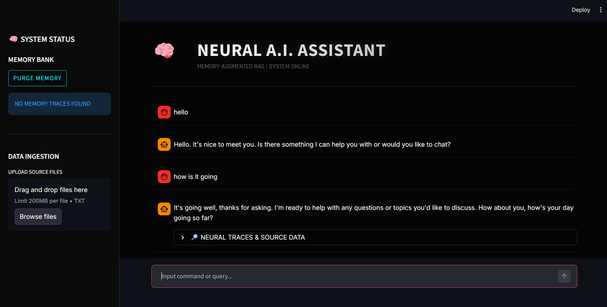

# 🧠 Memory-Augmented RAG


> A production-grade Retrieval-Augmented Generation (RAG) system with **persistent long-term memory**, built for high-performance context recall.

---

## 📸 Interface Preview



*Experience a premium Cyber-Dark UI powered by Streamlit.*

---

## ✨ Key Features

| Feature | Description |
| :--- | :--- |
| **🧠 Persistent Memory** | Uses **Mem0** to store and recall user interactions across sessions, creating a truly personalized AI experience. |
| **⚡ Blazing Fast RAG** | Powered by **Groq's LPU** inference engine and **ChromaDB** for millisecond-latency retrieval. |
| **📂 Smart Ingestion** | Drag-and-drop document upload with automatic chunking and embedding generation using local **Sentence Transformers**. |
| **🎨 Premium UI** | A fully custom "Cyber-Dark" interface with glassmorphism effects, neon accents, and responsive design. |
| **🔒 Privacy First** | Run entirely locally or with minimal cloud dependency. Your data stays in your control. |

---

## 🛠️ Tech Stack

This project leverages a modern, high-performance stack:

-   **Frontend**: [Streamlit](https://streamlit.io/) (with custom CSS injection)
-   **LLM Engine**: [Groq](https://groq.com/) (Llama 3.3 70B Versatile)
-   **Memory Layer**: [Mem0](https://mem0.ai/) (Local Vector + Graph Memory)
-   **Vector Store**: [ChromaDB](https://www.trychroma.com/) (Persistent Local Storage)
-   **Embeddings**: [HuggingFace](https://huggingface.co/) (all-MiniLM-L6-v2)

---

## 🚀 Getting Started

Follow these steps to deploy your own instance.

### 1. Clone the Repository
```bash
git clone https://github.com/yourusername/Memory-Augmented-RAG.git
cd Memory-Augmented-RAG
```

### 2. Install Dependencies
We recommend using a virtual environment (venv or uv).
```bash
pip install -r requirements.txt
# OR if using uv
uv sync
```

### 3. Configure Environment
Create a `.env` file in the root directory and add your API keys:

```ini
# LLM (Groq)
GROQ_API_KEY=gsk_your_key_here
GROQ_MODEL=llama-3.3-70b-versatile

# Memory & Vector Store (Local Mode)
CHROMA_PERSIST_DIR=./chroma_db
MEM0_COLLECTION=rag_memory
```

### 4. Launch the App
```bash
streamlit run app.py
```

---

## 💡 How It Works

1.  **Ingestion**: When you upload a document, it is split into chunks and stored in **ChromaDB** as vector embeddings.
2.  **Interaction**: When you ask a question, the system searches:
    *   **ChromaDB** for relevant document chunks.
    *   **Mem0** for relevant past interactions and user preferences.
3.  **Generation**: The LLM receives your question + document context + memory context to generate a highly personalized and accurate answer.
4.  **Learning**: The interaction is automatically distilled and stored back into **Mem0**, becoming part of the long-term context for future queries.

---


## 🗺️ Project Architecture

```
┌─────────────────┐       ┌──────────────────────┐
│  Streamlit UI   ├──────►│  RAG Query Pipeline  │
└────────┬────────┘       └──────────┬───────────┘
         │                           │
         ▼                           ▼
┌─────────────────┐       ┌──────────────────────┐
│   Mem0 (Local)  │       │ ChromaDB (Documents) │
└─────────────────┘       └──────────────────────┘
```

- **`app.py`**: The Streamlit user interface with CSS glassmorphic overrides.
- **`rag_pipeline.py`**: Coordinates text extraction, chunking, memory insertion, and Groq inference.
- **`vector_store.py`**: Handles low-level ChromaDB interaction and Sentence Transformers.
- **`memory.py`**: User-scoped persistent conversation engrams via Mem0.

## 🤝 Contributing

Contributions are welcome! Please feel free to submit a Pull Request

---

